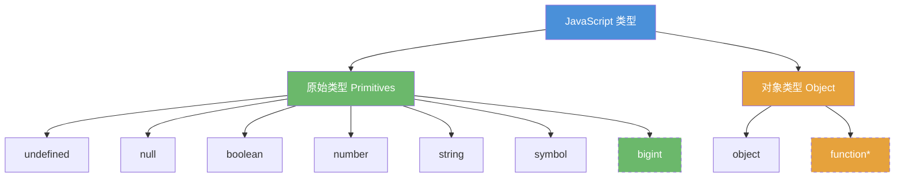
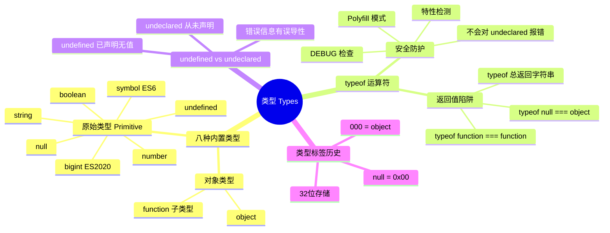
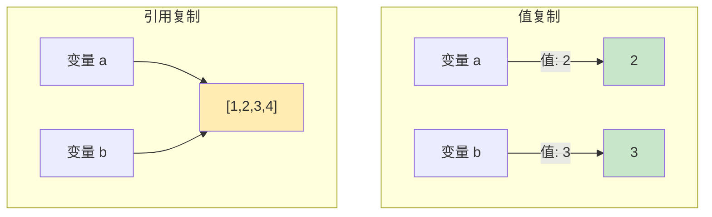
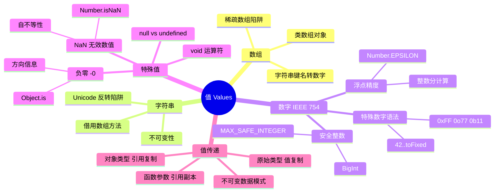
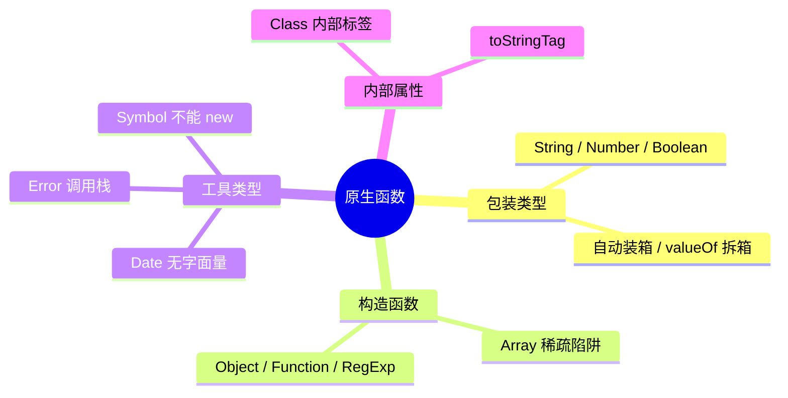
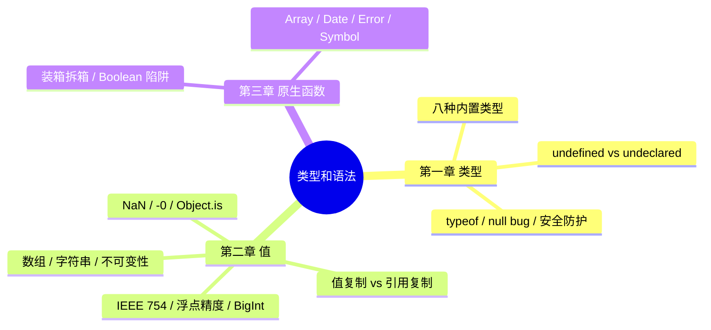

# 类型和语法

那些你以为你懂的 JavaScript

《你不知道的JavaScript（中卷）》第一部分 1-3章

<div class="pt-12">
  <span @click="$slidev.nav.next" class="px-2 py-1 rounded cursor-pointer" hover="bg-white bg-opacity-10">
    开始探索 <carbon:arrow-right class="inline"/>
  </span>
</div>

<div class="abs-br m-6 flex gap-2">
  <button @click="$slidev.nav.openInEditor()" title="Open in Editor" class="text-xl slidev-icon-btn opacity-50 !border-none !hover:text-white">
    <carbon:edit />
  </button>
</div>

---
layout: center
class: text-center
---

# 热身测验

<div class="text-left inline-block">

**以下表达式的结果是什么？**

| 表达式 | 结果 |
|--------|------|
| `typeof null === "object"` | <v-click>**true** ✅ type tag 设计缺陷</v-click> |
| `0.1 + 0.2 === 0.3` | <v-click>**false** ❌ IEEE 754 浮点无法精确表示</v-click> |
| `NaN === NaN` | <v-click>**false** ❌ IEEE 754 规定 NaN ≠ 任何值</v-click> |
| `typeof NaN === "number"` | <v-click>**true** ✅ NaN 是 number 类型的特殊值</v-click> |
| `-0 === 0` | <v-click>**true** ⚠️ === 不区分正负零</v-click> |
| `new Boolean(false) ? "truthy" : "falsy"` | <v-click>**"truthy"** 封装对象是 truthy</v-click> |

</div>

<v-click>

<div class="mt-4 text-lg opacity-80">

没全对？这次分享为你而来！

</div>

</v-click>

---
layout: section
---

# 第一章：类型

<div class="text-2xl mt-4 opacity-80">

变量没有类型，值才有类型 — typeof 检测的是当前值的类型

</div>

---
layout: two-cols
layoutClass: gap-4
---

# 八种内置类型 + typeof

<div class="text-sm">

**八种内置类型（含 ES2020 BigInt）：**

1. `undefined`
2. `null`
3. `boolean`
4. `number`
5. `string`
6. `object`
7. `symbol` (ES6 新增)
8. `bigint` (ES2020 新增)

</div>



<div class="text-xs opacity-60 mt-2">

*function → object 子类型

</div>

::right::

```javascript {monaco}
// typeof 返回值
typeof undefined   // "undefined"
typeof true        // "boolean"
typeof 42          // "number"
typeof "42"        // "string"
typeof { a: 1 }    // "object"
typeof Symbol()    // "symbol"
typeof function(){} // "function" ← 子类型

// ⚠️ 异类
typeof null        // "object" ← BUG!
typeof []          // "object" ← 无专属类型

// ES2020 扩展
typeof 42n         // "bigint"
```

<div class="mt-4 text-sm">

<v-click>

typeof 识别八种，`null` 例外。
`function` 非顶层类型却有专属返回值。

</v-click>

</div>

---
layout: default
---

# typeof null — 历史真相

<div class="text-sm">

**JS 最著名的 bug，V1 起至今未修复。**

**类型标签 (Type Tag)：**
SpiderMonkey 用 32 位存储值，最低位标记类型：

- `000` → object | `xx1` → int | `010` → double
- `100` → string | `110` → boolean

`null` → 空指针 `0x00` → 标签 `000` → 与 object 相同！

```javascript {monaco}
// 安全判断 null
var a = null;
(!a && typeof a === "object"); // true — 排除其他 falsy 值中只有 null 的 typeof 是 "object"
// 但实际生产代码直接用：a === null
// 曾有提案修复 typeof null 返回 "null"，TC39 否决，因为会破坏大量现有代码
```

</div>

---
layout: two-cols
layoutClass: gap-4
---

# undefined vs undeclared

<div class="text-sm">

**undefined：** 变量已声明但未赋值

```javascript {monaco}
var a;
typeof a; // "undefined"
a;        // undefined (可以访问)
// undefined 是个值，不是"什么都没有"
```

<v-click>

<div class="mt-2 p-2 bg-yellow-500 bg-opacity-10 rounded">

**注意：** `undefined` ≠ "没有定义"
- `undefined` = 已声明，无值
- undeclared = 从未声明

</div>

</v-click>

</div>

::right::

<div class="text-sm">

**undeclared：** 变量从未声明

```javascript {monaco}
// b 从未用 var/let/const 声明
b; // ReferenceError: b is not defined
// ⚠️ "not defined" 其实指"从未声明"
```

<v-click>

**typeof 的安全防护：**

```javascript {monaco}
// typeof 对 undeclared 变量不会报错！
typeof b; // "undefined" ← 不报错
// 这让我们可以安全地检测变量是否存在（下页详解）
```

</v-click>

</div>

---
layout: default
---

# typeof 安全防护 — 实战场景

<div class="text-sm">

**场景一：DEBUG 模式检查**

```javascript {monaco}
if (DEBUG) { console.log("调试"); } // ❌ DEBUG 未声明直接 ReferenceError
if (typeof DEBUG !== "undefined" && DEBUG) { console.log("调试"); } // ✅ 安全检测：未声明不报错，声明为 falsy 时也跳过
```

**场景二：Polyfill 模式**

```javascript {monaco}
if (typeof Promise === "undefined") { /* 加载 polyfill */ }
```

**场景三：SDK 特性检测**

```javascript {monaco}
function isNode() {
  return typeof process !== "undefined"
    && process.versions?.node != null;
}
```

<v-click>

**ES2020 扩展：** `globalThis` 提供了跨环境访问全局对象的标准方式，
部分替代了 typeof 防护的需求。

</v-click>

</div>

---
layout: default
---

# typeof 测验

<div class="text-sm">

| 表达式 | 结果 |
|--------|------|
| `typeof void 0` | <v-click>**"undefined"** void 总返回 undefined</v-click> |
| `typeof (() => {})` | <v-click>**"function"** 箭头函数也是函数</v-click> |
| `typeof class C {}` | <v-click>**"function"** class 底层是函数</v-click> |
| `typeof 42n` | <v-click>**"bigint"** ES2020</v-click> |
| `typeof Symbol.iterator` | <v-click>**"symbol"**</v-click> |
| `typeof null` | <v-click>**"object"** 经典 bug</v-click> |
| `typeof typeof 42` | <v-click>**"string"** typeof 总返回字符串</v-click> |
| `typeof NaN` | <v-click>**"number"** 无效数值仍属 number</v-click> |

</div>

<v-click>

<div class="mt-4 text-sm opacity-60">

关键记忆：typeof 总是返回一个**字符串**，
所以 typeof typeof anything 恒等于 "string"

</div>

</v-click>

---
layout: default
---

# 第一章知识图谱



---
layout: section
---

# 第二章：值

<div class="text-2xl mt-4 opacity-80">

数组、字符串、数字……常见误区与边界行为

</div>

---
layout: default
---

# 数组

<div class="text-sm">

**JavaScript 数组可以容纳任何类型的值，不需要预先声明大小。**

**陷阱一：稀疏数组 (Sparse Array)**

```javascript {monaco}
var a = [];
a[0] = 1;
a[2] = 3;  // 跳过 a[1]
a[1];      // undefined（空槽，map/forEach 会跳过）
a.length;  // 3
```

**陷阱二：字符串键名**

```javascript {monaco}
var a = [];
a["13"] = 42;       // 转为数字索引
a.length;           // 14！不是 1
a["foobar"] = "baz";
a.length;           // 14（非数字键不影响 length）
```

**建议：** 使用 `Array.from()` 或展开运算符处理类数组对象，避免稀疏数组。

</div>

---
layout: two-cols
layoutClass: gap-4
---

# 字符串

<div class="text-sm">

**字符串是不可变的 (Immutable)**

```javascript {monaco}
var a = "foo";
a[1] = "O";
a; // "foo" — 没变！字符串方法总是返回新值
a.toUpperCase(); // "FOO"  a; // 仍是 "foo"
```

<v-click>

**借用数组方法：**

```javascript {monaco}
[].join.call("foo", "-"); // "f-o-o"
[].map.call("foo", c => c.toUpperCase()).join(""); // "FOO"
```

</v-click>

</div>

::right::

<div class="text-sm pt-4">

**字符串反转的陷阱**

```javascript {monaco}
// ⚠️ split('') 按 UTF-16 码元拆散代理对
// [...str] 按码点拆分，修复代理对但仍拆散 ZWJ 序列（如 👨‍👩‍👧）
// 完整方案：[...new Intl.Segmenter().segment(str)].map(s=>s.segment).reverse().join('')
```

<v-click>

<div class="mt-4 p-3 bg-blue-500 bg-opacity-10 rounded">

**核心区别：**
- 字符串 — 不可变，类数组但不是数组
- 数组 — 可变，方法会修改原数组

</div>

</v-click>

</div>

---
layout: default
---

# IEEE 754 与数字语法

<div class="text-sm">

**JS 数字都是 IEEE 754 双精度浮点：** 52 位尾数决定精度上限

**有趣的数字语法：**

```javascript {monaco}
// 小数点的二义性
42.toFixed(3);  // SyntaxError — 42. 被解析为浮点数
42..toFixed(3); // "42.000" — 第一个.是小数点，第二个.是属性访问
(42).toFixed(3); // "42.000"
// 其他进制：0xf3 (hex) / 0o363 (octal) / 0b11110011 (binary) → 243
```

**注意：** JavaScript 没有"整数"类型。
`42` 和 `42.0` 完全相同，所有数字都是浮点数。

</div>

---
layout: center
---

# 0.1 + 0.2 !== 0.3

<div class="mt-4">

```javascript {monaco}
0.1 + 0.2 === 0.3; // false!
0.1 + 0.2; // 0.30000000000000004
// 0.1 和 0.2 无法用有限位二进制精确表示，存储时产生舍入误差
```

</div>

<v-clicks>

<div class="mt-4">

**解决方案：Number.EPSILON (ES6)**

```javascript {monaco}
function numbersCloseEnoughToEqual(n1, n2) {
  return Math.abs(n1 - n2) < Number.EPSILON; // 2^-52，仅适用于量级接近 1 的数
// ⚠️ 大数场景需用相对误差：Math.abs(n1-n2) <= Math.max(Math.abs(n1),Math.abs(n2)) * Number.EPSILON
}
numbersCloseEnoughToEqual(0.1 + 0.2, 0.3); // true
```

</div>

<div class="mt-4 p-3 bg-red-500 bg-opacity-10 rounded">

**业务实践：金额用整数（分）计算**

❌ `19.9 * 3` → 59.699999...

✅ `1990 * 3` → 5970 → `(5970 / 100).toFixed(2)` → "59.70"

</div>

</v-clicks>

---
layout: default
---

# 安全整数范围

<div class="text-sm">

**Number.MAX_SAFE_INTEGER = 2^53 - 1 = 9007199254740991**

```javascript {monaco}
9007199254740991 + 1; // 9007199254740992 ✅
9007199254740991 + 2; // 9007199254740992 ❌ 和 +1 结果相同，不同值无法区分
Number.isSafeInteger(9007199254740992); // true — 2^53 本身可精确表示
Number.isSafeInteger(9007199254740993); // false — 超出安全范围
```

**ES2020 BigInt — 任意精度整数**

```javascript {monaco}
const big = 9007199254740991n + 2n; // 9007199254740993n ✅
typeof big; // "bigint" — 第八种类型
// BigInt 不能和 Number 混算：1n+1 → TypeError
// 转换：BigInt(1) 或 Number(1n)（大值会丢精度）
// 注意：1n === 1 → false; JSON.stringify(1n) → TypeError
```

<div class="mt-2 p-2 bg-yellow-500 bg-opacity-10 rounded">

**业务场景：** 雪花ID 超 2^53 时
JSON.parse 丢精度。
方案：(1) 后端返回字符串 ID
(2) 前端用 json-bigint

</div>

</div>

---
layout: two-cols
layoutClass: gap-4
---

# null vs undefined

<div class="text-sm">

<v-click>

| | `null` | `undefined` |
|---|---|---|
| 含义 | 主动赋值为空（有意为空） | 从未赋值 |
| typeof | `"object"` (bug) | `"undefined"` |
| 转数字 | `0` ⚠️ | `NaN` |

> null 静默转为 0 是常见 bug 源：`null * 5 === 0`

</v-click>

<v-click>

```javascript {monaco}
var a = null; // 主动赋值为空
var b;        // 声明但未赋值 → undefined
function foo(x) { return x; }
foo();        // undefined — 参数缺失
```

</v-click>

</div>

::right::

<div class="text-sm">

<v-click>

**void 运算符**

```javascript {monaco}
void 0; // 始终返回 undefined
// ES5 前全局 undefined 可被重写：
// var undefined = 42; → 所有 === undefined 判断失效
// void 0 不受影响，因此老代码中常见
```

</v-click>

<v-click>

**void 的实际用途：**
- `void 0` 代替 `undefined`
- `javascript:void(0)` 阻止跳转
- `void expr` 丢弃返回值

</v-click>

</div>

---
layout: default
---

# NaN — "不是数字"的数字

<div class="text-sm">

```javascript {monaco}
typeof NaN; // "number" — 看似矛盾，但 NaN 的含义是"无效数值"，仍属 number 类型
var a = 2 / "foo"; // NaN
```

**NaN 不等于自身 — JavaScript 中唯一！**

```javascript {monaco}
NaN === NaN; // false
a === NaN;   // false — 无法用 === 检测 NaN
```

**isNaN() 的 bug 与 Number.isNaN() 的修复**

```javascript {monaco}
isNaN("foo");        // true ❌ 先转 Number("foo")→NaN，再判断
Number.isNaN("foo"); // false ✅
Number.isNaN(NaN);   // true ✅
// Polyfill（仅示意）: if (!Number.isNaN) Number.isNaN = n => typeof n === 'number' && n !== n;
```

</div>

---
layout: default
---

# -0 与 Object.is()

<div class="text-sm">

**负零：一个被隐藏的值**

```javascript {monaco}
var a = 0 / -3; // -0
-0 === 0;       // true ← 无法区分！
(-0).toString(); // "0" ← 丢失符号
JSON.stringify(-0); // "0" ← 符号丢失！
JSON.parse("-0");  // -0  ← 符号保留（不对称行为）
```

**为什么需要 -0？** 值为零时保留方向信息：

velocity: -1 → -0.5 → **-0**（向左减速到停止，保留"向左"）

velocity:  1 →  0.5 →  **0** （向右减速到停止）

如果 -0 变成 0，就无法判断物体从哪个方向停下。

**Object.is() — ES6 终极比较 (SameValue)**

```javascript {monaco}
Object.is(NaN, NaN); // true ✅（=== 返回 false）
Object.is(-0, 0);    // false ✅（=== 返回 true）
Object.is(42, 42);   // true（正常情况和 === 一致）
// 用途提示：Object.is() 用于需要区分 NaN/-0 的场景，其他情况 === 更语义清晰
```

</div>

---
layout: two-cols
layoutClass: gap-4
---

# 值复制 vs 引用复制

<div class="text-sm">

**原始类型 — 值复制**

```javascript {monaco}
var a = 2; var b = a; b++; a; // 2 — 不受影响
```

**对象类型 — 引用复制**

```javascript {monaco}
var a = [1,2,3]; var b = a; b.push(4);
a; // [1,2,3,4] — a 也变了！同一个引用
```

</div>

<v-click>

<div class="text-sm mt-2">

**注意：** b = a 时，b 拿到的是引用的副本，
不是指向 a 的指针。
所以 b = [4,5,6] 只改 b 的指向，a 不受影响。

</div>

</v-click>

::right::



<v-click>

<div class="text-sm mt-2">

**规则：** 由值的类型决定传递方式：
- 原始类型 → 值复制（独立副本）
- object（含数组、函数）→ 引用复制（共享同一对象）

</div>

</v-click>

---
layout: default
---

# 函数参数的引用误区

<div class="text-sm">

**函数参数传递的是引用的副本，不是引用本身。**
- `foo(a)` 时 x 和 a 指向同一个数组
- 但 x 是独立变量
- `x.push()` 修改共享数组
- `x = [...]` 让 x 指向新数组，a 不受影响

```javascript {monaco}
function foo(x) {
  x.push(4);     // 通过引用修改了原数组
  x = [4, 5, 6]; // ⚠️ 创建了新引用！
  x.push(7);     // 修改的是新数组
}
var a = [1, 2, 3];
foo(a);
a; // [1, 2, 3, 4] — 不是 [4, 5, 6, 7]！
```

**图解：**

```
调用前：  a ──→ [1,2,3]    x ──→ [1,2,3] （同一个数组）
push(4)：a ──→ [1,2,3,4]  x ──→ [1,2,3,4] ✅
x=[4,5,6]：a ──→ [1,2,3,4]  x ──→ [4,5,6] ❌ 分离了
```

**结论：** 重新赋值 ≠ 修改。
`x.push()` 修改引用指向的值；
`x = [...]` 改变 x 本身的指向。

</div>

---
layout: default
---

# 业务实践：不可变数据

<div class="text-sm">

**经典 Redux bug：**

```javascript {monaco}
// ❌ 直接修改 state，Redux 检测不到变化
function reducer(state, action) {
  state.items.push(action.payload); // 突变！
  return state; // 同一个引用，React 不会重渲染
}
// ✅ 创建新引用
function reducer(state, action) {
  return { ...state, items: [...state.items, action.payload] };
}
```

**structuredClone — 原生深拷贝**

```javascript {monaco}
const clone = structuredClone({ a: 1, b: { c: 2 }, d: new Date() });
// 支持 Date/Map/Set/ArrayBuffer/RegExp
// ❌ 函数、DOM 节点、Symbol 键 → 抛 DataCloneError
// 替代 JSON.parse(JSON.stringify(...)) 的笨方法
```

</div>

---
layout: center
---

# 第二章测验

<div class="text-left inline-block text-sm">

| 表达式 | 结果 |
|--------|------|
| `[,,,].length` | <v-click>**3** 三个逗号 = 三个空槽（末尾逗号不计）</v-click> |
| `"abc"[1] = "B"; "abc"[1]` | <v-click>**"b"** 字符串不可变（严格模式抛 TypeError）</v-click> |
| `0.1 + 0.2 > 0.3` | <v-click>**true**</v-click> |
| `Number.isNaN("NaN")` | <v-click>**false** 字符串不是 NaN</v-click> |
| `Object.is(-0, 0)` | <v-click>**false**</v-click> |
| `var a=[1,2]; var b=a; b=[3,4]; a` | <v-click>**\[1,2\]** 重新赋值不影响</v-click> |
| `Number(null) + Number(undefined)` | <v-click>**NaN** 0 + NaN</v-click> |
| `9007199254740992 === 9007199254740993` | <v-click>**true** 超安全范围</v-click> |

</div>

---
layout: default
---

# 第二章知识图谱



---
layout: section
---

# 第三章：原生函数

<div class="text-2xl mt-4 opacity-80">

不要用 new Boolean(false)！

</div>

---
layout: default
---

# 原生函数与 [[Class]]

<div class="text-sm">

**JavaScript 的内置原生函数：**
`String` `Number` `Boolean` `Array` `Object`
`Function` `RegExp` `Date` `Error` `Symbol`

**内部 [[Class]] 属性 — 值的"身份证"**

```javascript {monaco}
Object.prototype.toString.call([1,2,3]);   // "[object Array]"
Object.prototype.toString.call(/regex/i);  // "[object RegExp]"
Object.prototype.toString.call(null);      // "[object Null]"
Object.prototype.toString.call(undefined); // "[object Undefined]"
// 原始值会被自动"装箱"
Object.prototype.toString.call("abc");     // "[object String]"
Object.prototype.toString.call(42);        // "[object Number]"
```

**ES6 扩展：** 上面的标签（Array、RegExp 等）是内置固定的。ES6 新增 `Symbol.toStringTag` 可以让自定义类返回自己的标签。

</div>

---
layout: default
---

# 装箱与拆箱

<div class="text-sm">

**自动装箱 (Auto-Boxing)**

```javascript {monaco}
"abc".length;        // 3 — 原始值没有属性，引擎自动装箱
"abc".toUpperCase(); // "ABC"
(42).toFixed(2);     // "42.00"
// "abc" → new String("abc") → 调用方法 → 销毁包装对象
```

**拆箱 — valueOf()**

```javascript {monaco}
var a = new String("abc");
typeof a;    // "object" — 不是 "string"！
a.valueOf(); // "abc" — 拆箱得到原始值
(new Boolean(true)) + ""; // + "" 需要原始值，引擎自动调 valueOf() → true → "true"
```

<div class="mt-2 p-2 bg-green-500 bg-opacity-10 rounded">

**引擎优化提示：** 不要手动装箱（`new String("abc")`），
引擎对原始值的优化远比包装对象好。

</div>

</div>

---
layout: center
---

# Boolean 陷阱

<div class="mt-4 text-2xl">

```javascript {monaco}
var a = new Boolean(false);
if (a) { console.log("这行会执行吗？"); }
// 会！a 是对象，对象永远是 truthy！
```

</div>

<v-clicks>

<div class="mt-4 text-lg">

`new Boolean(false)` 是**包装对象**，不是 `false`。
对象 → truthy → 条件判断失效！

</div>

<div class="mt-4 p-3 bg-red-500 bg-opacity-10 rounded text-sm">

```javascript {monaco}
// ❌ new Boolean(apiResponse.active) — 包装对象永远 truthy
// ✅ 正确做法：
// Boolean(value) — 不带 new，是类型转换，返回原始值 false
// !!value         — 双重取反，同样返回原始值 false
// 关键区别：new Boolean() → 对象(truthy)；Boolean() → 原始值
```

</div>

</v-clicks>

---
layout: default
---

# Array 构造函数的陷阱

<div class="text-sm">

```javascript {monaco}
// 只传一个数字参数时 — 它是长度，不是元素！
var a = new Array(3);
a; // [empty × 3] — 不是 [undefined, undefined, undefined]！
a.map((v, i) => i); // [empty × 3] ← map 跳过空槽！
[undefined, undefined, undefined].map((v, i) => i); // [0, 1, 2]
```

**安全创建数组的方式：**

```javascript {monaco}
Array.from({ length: 3 });              // [undefined, undefined, undefined]
Array.from({ length: 3 }, (_, i) => i); // [0, 1, 2]
Array(3).fill(0);                        // [0, 0, 0]
```

**规则：** 永远不要创建和使用稀疏数组。
用 `Array.from()` 或 `Array(n).fill()`。

</div>

---
layout: default
---

# Date / Error / Symbol

<div class="text-sm">

**Date — 唯一没有字面量形式的原生类型**

```javascript {monaco}
Date.now(); // 毫秒时间戳（推荐）。需微秒精度用 performance.now()
new Date(2026, 5, 4); // 月份从 0 开始！5 = 六月
// 推荐用 ISO 字符串避免混淆：new Date('2026-06-04')
```

**Error — 自动捕获调用栈**

```javascript {monaco}
throw new Error("something went wrong"); // 自动包含 stack
// ES2022: Error.cause — 把原始错误附加到新错误上，追溯根因
throw new Error("加载失败", { cause: originalErr });
// catch 时通过 err.cause 拿到原始错误
```

**Symbol — ES6 新增，不能用 new**

```javascript {monaco}
var sym = Symbol("desc"); // 不能 new Symbol()！
typeof sym; // "symbol" — 用于对象唯一属性键和内置钩子
```

</div>

---
layout: default
---

# 原生原型

<div class="text-sm">

**原生构造函数的 prototype 本身就是其类型的"空值"实例。**

```javascript {monaco}
typeof Function.prototype; // "function" — 空函数，可以调用
Array.prototype;           // [] — 空数组
String.prototype;          // String{''}  — 空字符串对象
RegExp.prototype.toString(); // "/(?:)/" — 空正则
```

**曾有人建议用原型作默认值（现在不推荐）：**

```javascript {monaco}
// ❌ function foo(arr = Array.prototype, fn = Function.prototype) {}
// 因为原型是已存在的空值单例，有人曾用它避免每次创建新对象
// ✅ 现代写法：
function foo(arr = [], fn = () => {}) {}
```

**要点：** 了解原生原型有助于理解对象系统，但实际代码应使用字面量和现代语法。

</div>

---
layout: two-cols
layoutClass: gap-4
---

# 第三章测验

<div class="text-xs">

| 表达式 | 结果 |
|--------|------|
| `typeof new String("abc")` | <v-click>**"object"** 包装对象</v-click> |
| `new Boolean(0) ? 1 : 2` | <v-click>**1** 有 new → 对象，对象永远 truthy</v-click> |
| `Array(1,2,3).length` | <v-click>**3** 多参数是元素</v-click> |
| `Array(3).length` | <v-click>**3** 单数字是长度</v-click> |
| `Object.prototype.toString.call(null)` | <v-click>**"[object Null]"**</v-click> |
| `typeof Symbol("x")` | <v-click>**"symbol"**</v-click> |

</div>

::right::



---
layout: default
---

# 全景知识图谱

<div class="mt-2">



</div>

---
layout: center
class: text-center
---

# 五大核心收获

<v-clicks>

<div class="text-xl mt-6">

**1. 变量没有类型，值才有类型**

</div>

<div class="text-xl mt-4">

**2. 金额计算永远用整数（分）**

</div>

<div class="text-xl mt-4">

**3. 用 Number.isNaN() 而非 isNaN()**

</div>

<div class="text-xl mt-4">

**4. 永远不要 new Boolean / String / Number**

</div>

<div class="text-xl mt-4">

**5. 对象按引用复制，注意不可变模式**

</div>

</v-clicks>

<v-click>

<div class="mt-6 text-sm opacity-60">

记住这五条，你已经比大多数 JavaScript 开发者更了解类型了。

</div>

</v-click>

---
layout: center
class: text-center
---

# 下期预告

<div class="text-3xl mt-8">

**第二部分：强制类型转换**

</div>

<div class="mt-8 text-xl opacity-80">

<v-clicks>

- `[] == ![]` 为什么是 `true`？
- `"" == 0` 为什么是 `true`？
- 隐式转换到底是特性还是 bug？
- 如何建立一套安全的类型转换心智模型？

</v-clicks>

</div>

<div class="mt-8 text-sm opacity-50">

《你不知道的JavaScript（中卷）》第一部分 第4-5章

</div>

---
layout: center
class: text-center
---

# 谢谢！

<div class="text-2xl mt-8">

Q & A

</div>

<div class="text-xl mt-8 opacity-80">

"类型之于值，如同规则之于行为 —— 你不了解规则，就不可能真正掌控行为。"

</div>

<div class="mt-12">

<span class="text-sm opacity-50">按 ESC 退出演示模式</span>

</div>
