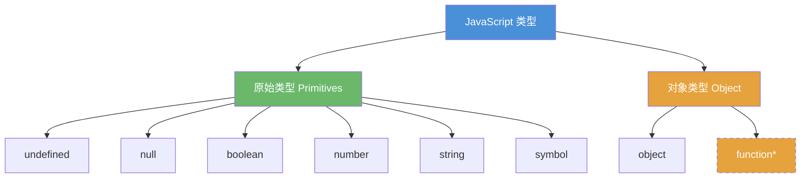
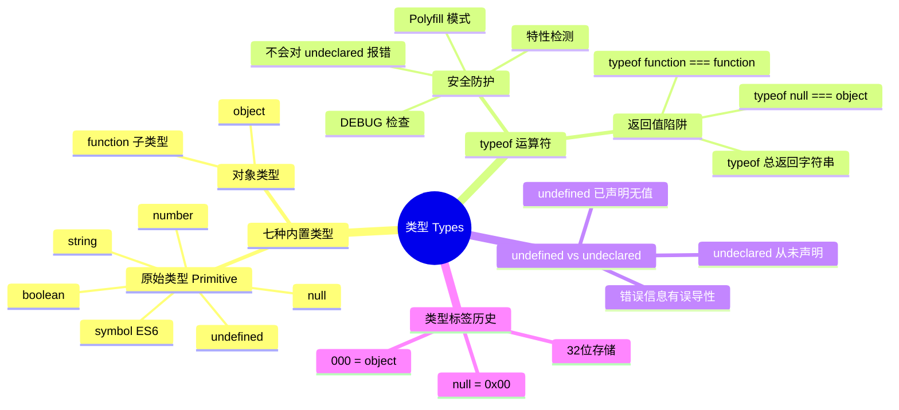
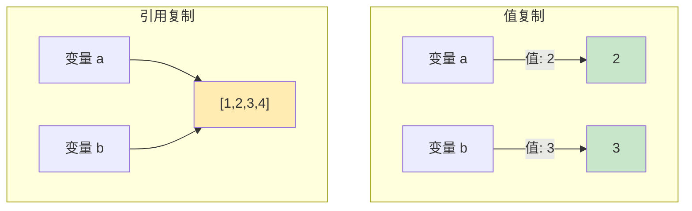
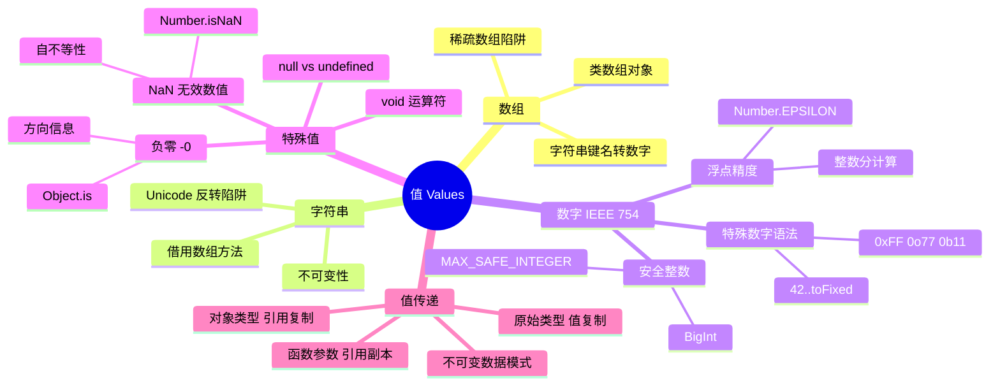
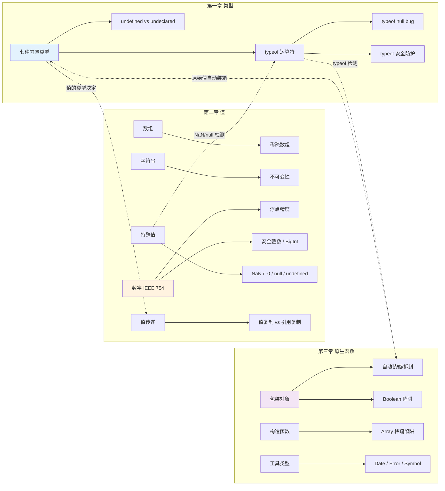

# 类型和语法

那些你以为你懂的 JavaScript

《你不知道的JavaScript（中卷）》第一部分 1-3章

<div class="pt-12">
  <span @click="$slidev.nav.next" class="px-2 py-1 rounded cursor-pointer" hover="bg-white bg-opacity-10">
    开始探索 <carbon:arrow-right class="inline"/>
  </span>
</div>

<div class="abs-br m-6 flex gap-2">
  <button @click="$slidev.nav.openInEditor()" title="Open in Editor" class="text-xl slidev-icon-btn opacity-50 !border-none !hover:text-white">
    <carbon:edit />
  </button>
</div>

---
layout: center
class: text-center
---

# 热身测验

<div class="text-left inline-block text-xl">

以下表达式的结果是什么？

<v-clicks>

- `typeof null === "object"` &nbsp;&nbsp; → &nbsp;&nbsp; **true** ✅ &nbsp; 历史 bug！
- `0.1 + 0.2 === 0.3` &nbsp;&nbsp; → &nbsp;&nbsp; **false** ❌ &nbsp; IEEE 754 浮点精度
- `NaN === NaN` &nbsp;&nbsp; → &nbsp;&nbsp; **false** ❌ &nbsp; NaN 不等于任何值，包括自己
- `typeof NaN === "number"` &nbsp;&nbsp; → &nbsp;&nbsp; **true** ✅ &nbsp; "不是数字"的数字
- `-0 === 0` &nbsp;&nbsp; → &nbsp;&nbsp; **true** ✅ &nbsp; 负零被"善意的谎言"掩盖了
- `new Boolean(false) ? "truthy" : "falsy"` &nbsp;&nbsp; → &nbsp;&nbsp; **"truthy"** &nbsp; 对象永远是真值！

</v-clicks>

</div>

<v-click>

<div class="mt-6 text-lg opacity-80">

如果你没有全答对，这次分享就是为你准备的！

</div>

</v-click>

---
layout: section
---

# 第一章：类型

<div class="text-2xl mt-4 opacity-80">

变量没有类型，值才有类型

</div>

---
layout: two-cols
layoutClass: gap-4
---

# 七种内置类型 + typeof

<div class="text-sm">

**七种内置类型：**

1. `undefined`
2. `null`
3. `boolean`
4. `number`
5. `string`
6. `object`
7. `symbol` (ES6 新增)

</div>



<div class="text-xs opacity-60 mt-2">

*function 是 object 的子类型，但 typeof 返回 "function"

</div>

::right::

```javascript {monaco}
// typeof 返回值 — 注意不对称！
typeof undefined   // "undefined"
typeof true        // "boolean"
typeof 42          // "number"
typeof "42"        // "string"
typeof { a: 1 }    // "object"
typeof Symbol()    // "symbol"
typeof function(){} // "function" ← 子类型

// ⚠️ 两个"异类"
typeof null        // "object" ← BUG!
typeof []          // "object" ← 数组没有专属类型

// ES2020 扩展
typeof 42n         // "bigint"
```

<div class="mt-4 text-sm">

<v-click>

**注意：** 七种类型中，typeof 能准确识别六种，唯独 `null` 是个例外。而 `function` 虽然不是顶层类型，typeof 却给了它专属返回值。

</v-click>

</div>

---
layout: default
---

# typeof null — 历史真相

<div class="text-sm">

<v-clicks>

**这是 JavaScript 最著名的 bug，从第一版就存在，可能永远不会被修复。**

**类型标签机制 (Type Tag)：** 最初实现中，值以 32 位存储，低 1-3 bits 为类型标签：

`000` → object | `1` → int | `010` → double | `100` → string | `110` → boolean

`null` 的机器码是空指针 `0x00`，类型标签也是 `000` — 和 object 一模一样！

```javascript {monaco}
// 安全判断 null 的模式
var a = null;
(!a && typeof a === "object"); // true — 唯一的 falsy object
// 曾有 TC39 提案修复，但因会破坏太多现有代码而被否决
```

</v-clicks>

</div>

---
layout: two-cols
layoutClass: gap-4
---

# undefined vs undeclared

<div class="text-sm">

**undefined：** 变量已声明但未赋值

```javascript {monaco}
var a;
typeof a; // "undefined"
a;        // undefined (可以访问)
// undefined 是一个值！类型为 undefined 的只有它一个值
```

<v-click>

<div class="mt-2 p-2 bg-yellow-500 bg-opacity-10 rounded">

**注意：** `undefined` ≠ "没有定义"
- `undefined` = 已声明，无值
- undeclared = 从未声明

</div>

</v-click>

</div>

::right::

<div class="text-sm">

**undeclared：** 变量从未声明

```javascript {monaco}
// b 从未用 var/let/const 声明
b; // ReferenceError: b is not defined
// ⚠️ "not defined" 有误导性，应该叫 "not declared"
```

<v-click>

**typeof 的安全防护：**

```javascript {monaco}
// typeof 对 undeclared 变量不会报错！
typeof b; // "undefined" ← 不是 ReferenceError
// 这个"bug"反而是有用的安全机制
```

</v-click>

</div>

---
layout: default
---

# typeof 安全防护 — 实战场景

<div class="text-sm">

<v-clicks>

**场景一：DEBUG 模式检查**

```javascript {monaco}
if (DEBUG) { console.log("调试模式"); } // ❌ DEBUG 未声明会报错
if (typeof DEBUG !== "undefined") { console.log("调试模式"); } // ✅
```

**场景二：Polyfill 模式**

```javascript {monaco}
if (typeof Promise === "undefined") { /* 加载 polyfill */ }
```

**场景三：SDK 特性检测**

```javascript {monaco}
function isNode() {
  return typeof process !== "undefined"
    && typeof process.versions?.node !== "undefined";
}
```

</v-clicks>

<v-click>

**ES2020 扩展：** `globalThis` 提供了跨环境访问全局对象的标准方式，部分替代了 typeof 防护的需求。

</v-click>

</div>

---
layout: center
---

# typeof 测验

<div class="text-left inline-block text-lg">

以下表达式的结果是什么？

<v-clicks>

1. `typeof void 0` &nbsp;&nbsp; → &nbsp;&nbsp; **"undefined"** &nbsp; void 运算符总是返回 undefined
2. `typeof (() => {})` &nbsp;&nbsp; → &nbsp;&nbsp; **"function"** &nbsp; 箭头函数也是函数
3. `typeof class C {}` &nbsp;&nbsp; → &nbsp;&nbsp; **"function"** &nbsp; class 是函数的语法糖
4. `typeof 42n` &nbsp;&nbsp; → &nbsp;&nbsp; **"bigint"** &nbsp; ES2020 第八种类型
5. `typeof Symbol.iterator` &nbsp;&nbsp; → &nbsp;&nbsp; **"symbol"**
6. `typeof null` &nbsp;&nbsp; → &nbsp;&nbsp; **"object"** &nbsp; 经典 bug
7. `typeof typeof 42` &nbsp;&nbsp; → &nbsp;&nbsp; **"string"** &nbsp; typeof 总是返回字符串
8. `typeof NaN` &nbsp;&nbsp; → &nbsp;&nbsp; **"number"** &nbsp; "不是数字"的数字

</v-clicks>

</div>

<v-click>

<div class="mt-6 text-sm opacity-60">

关键记忆：typeof 总是返回一个**字符串**，所以 typeof typeof anything 恒等于 "string"

</div>

</v-click>

---
layout: default
---

# 第一章知识图谱



---
layout: section
---

# 第二章：值

<div class="text-2xl mt-4 opacity-80">

数组、字符串、数字……处处都是坑

</div>

---
layout: default
---

# 数组

<div class="text-sm">

<v-clicks>

**JavaScript 数组可以容纳任何类型的值，不需要预先声明大小。**

**陷阱一：稀疏数组 (Sparse Array)**

```javascript {monaco}
var a = [];
a[0] = 1;
a[2] = 3;  // 跳过 a[1]
a[1];      // undefined（但不是真正的 undefined 值！）
a.length;  // 3 — 空槽和显式 undefined 不同
```

**陷阱二：字符串键名**

```javascript {monaco}
var a = [];
a["13"] = 42;       // ⚠️ "13" 被转换为数字索引
a.length;           // 14！不是 1
a["foobar"] = "baz";
a.length;           // 14（非数字键不影响 length）
```

</v-clicks>

**建议：** 使用 `Array.from()` 或展开运算符处理类数组对象，避免稀疏数组。

</div>

---
layout: two-cols
layoutClass: gap-4
---

# 字符串

<div class="text-sm">

**字符串是不可变的 (Immutable)**

```javascript {monaco}
var a = "foo";
a[1] = "O";
a; // "foo" — 没变！字符串方法总是返回新值
a.toUpperCase(); // "FOO"  a; // 仍是 "foo"
```

<v-click>

**借用数组方法：**

```javascript {monaco}
Array.prototype.join.call("foo", "-"); // "f-o-o"
Array.prototype.map.call("foo", c => c.toUpperCase()).join(""); // "FOO"
```

</v-click>

</div>

::right::

<div class="text-sm pt-4">

**字符串反转的陷阱**

```javascript {monaco}
"foo".split("").reverse().join(""); // "oof" — OK?
// ⚠️ Unicode 会翻车！组合字符错位
// ✅ ES6: [...str].reverse().join("")
```

<v-click>

<div class="mt-4 p-3 bg-blue-500 bg-opacity-10 rounded">

**核心区别：**
- 字符串 — 不可变，类数组但不是数组
- 数组 — 可变，方法会修改原数组

</div>

</v-click>

</div>

---
layout: default
---

# IEEE 754 与数字语法

<div class="text-sm">

<v-clicks>

**JavaScript 的 number 基于 IEEE 754 "双精度"64 位格式：** 1bit 符号 + 11bits 指数 + 52bits 尾数

**有趣的数字语法：**

```javascript {monaco}
// 小数点的二义性
42.toFixed(3);  // SyntaxError — 引擎把 . 当成小数点
42..toFixed(3); // "42.000" — 第一个.是小数点，第二个.是属性访问
(42).toFixed(3); // "42.000"
// 其他进制：0xf3 (hex) / 0o363 (octal) / 0b11110011 (binary) → 243
```

**注意：** JavaScript 没有"整数"类型。`42` 和 `42.0` 完全相同，所有数字都是浮点数。

</v-clicks>

</div>

---
layout: center
---

# 0.1 + 0.2 !== 0.3

<div class="mt-4">

```javascript {monaco}
0.1 + 0.2 === 0.3; // false!
0.1 + 0.2; // 0.30000000000000004
// 因为 0.1 和 0.2 在二进制浮点中都是无限循环小数
```

</div>

<v-clicks>

<div class="mt-4">

**解决方案：Number.EPSILON (ES6)**

```javascript {monaco}
function numbersCloseEnoughToEqual(n1, n2) {
  return Math.abs(n1 - n2) < Number.EPSILON; // 2^-52
}
numbersCloseEnoughToEqual(0.1 + 0.2, 0.3); // true
```

</div>

<div class="mt-4 p-3 bg-red-500 bg-opacity-10 rounded">

**业务实践：金额计算永远使用整数（分）！**
`❌ price = 19.9; total = price * 3; → 59.699999...`
`✅ priceInCents = 1990; total = priceInCents * 3; → 5970 → 59.70`

</div>

</v-clicks>

---
layout: default
---

# 安全整数范围

<div class="text-sm">

<v-clicks>

**Number.MAX_SAFE_INTEGER = 2^53 - 1 = 9007199254740991**

```javascript {monaco}
9007199254740991 + 1; // 9007199254740992 ✅
9007199254740991 + 2; // 9007199254740992 ❌ 精度丢失！
Number.isSafeInteger(9007199254740991 + 1); // false
```

**ES2020 BigInt — 任意精度整数**

```javascript {monaco}
const big = 9007199254740991n + 2n; // 9007199254740993n ✅
typeof big; // "bigint" — 第八种类型
// BigInt 不能和 Number 混合运算：1n + BigInt(1) → 2n ✅
```

<div class="mt-2 p-2 bg-yellow-500 bg-opacity-10 rounded">

**业务场景：** 后端大 ID（雪花ID）超 2^53 时，JSON.parse 丢精度。解决：让后端返回字符串，或用 `json-bigint` 库。

</div>

</v-clicks>

</div>

---
layout: two-cols
layoutClass: gap-4
---

# null vs undefined

<div class="text-sm">

<v-click>

| | `null` | `undefined` |
|---|---|---|
| 含义 | 曾赋过值，当前为空 | 从未赋值 |
| typeof | `"object"` (bug) | `"undefined"` |
| 转数字 | `0` | `NaN` |

</v-click>

<v-click>

```javascript {monaco}
var a = null; // 主动赋值为空
var b;        // 声明但未赋值 → undefined
function foo(x) { return x; }
foo();        // undefined — 参数缺失
```

</v-click>

</div>

::right::

<div class="text-sm">

<v-click>

**void 运算符**

```javascript {monaco}
void 0; // undefined — 比 undefined 安全
// ES5 前 undefined 可被重写！
// var undefined = 42; // 非严格模式下合法
```

</v-click>

<v-click>

**void 的实际用途：**
- 确保纯正 undefined：`void 0`
- 阻止返回值：`<a href="javascript:void(0)">`
- 箭头函数副作用：`() => void doSomething()`

</v-click>

</div>

---
layout: default
---

# NaN — "不是数字"的数字

<div class="text-sm">

<v-clicks>

```javascript {monaco}
typeof NaN; // "number" — 讽刺吧？更准确的理解：NaN 是"无效数值"
var a = 2 / "foo"; // NaN
```

**NaN 不等于自身 — JavaScript 中唯一！**

```javascript {monaco}
NaN === NaN; // false
a === NaN;   // false — 无法用 === 检测 NaN
```

**isNaN() 的 bug 与 Number.isNaN() 的修复**

```javascript {monaco}
isNaN("foo");        // true ❌ 字符串不是 NaN！
Number.isNaN("foo"); // false ✅
Number.isNaN(NaN);   // true ✅
// Polyfill: Number.isNaN = n => n !== n;
```

</v-clicks>

</div>

---
layout: default
---

# -0 与 Object.is()

<div class="text-sm">

<v-clicks>

**负零：一个被隐藏的值**

```javascript {monaco}
var a = 0 / -3; // -0
-0 === 0;       // true ← 说谎了！
(-0).toString(); // "0" ← 又说谎
JSON.stringify(-0); // "0"  JSON.parse("-0"); // -0 ← 诚实的
```

**为什么需要 -0？** 表示"方向"的场景（动画速度、坐标轴），符号位携带重要信息。

**Object.is() — ES6 终极比较 (SameValue)**

```javascript {monaco}
Object.is(NaN, NaN); // true ✅（=== 返回 false）
Object.is(-0, 0);    // false ✅（=== 返回 true）
Object.is(42, 42);   // true（正常情况和 === 一致）
// 性能提示：Object.is() 比 === 慢，只在需要区分 NaN/-0 时使用
```

</v-clicks>

</div>

---
layout: two-cols
layoutClass: gap-4
---

# 值复制 vs 引用复制

<div class="text-sm">

**原始类型 — 值复制**

```javascript {monaco}
var a = 2; var b = a; b++; a; // 2 — 不受影响
```

**对象类型 — 引用复制**

```javascript {monaco}
var a = [1,2,3]; var b = a; b.push(4);
a; // [1,2,3,4] — a 也变了！同一个引用
```

</div>

<v-click>

<div class="text-sm mt-2">

**注意：** 引用指向**值本身**，不是变量。没有"指针"概念。

</div>

</v-click>

::right::



<v-click>

<div class="text-sm mt-2">

**规则：** 原始类型(`null`/`undefined`/`string`/`number`/`boolean`/`symbol`) → 值复制；`object`(含数组、函数) → 引用复制。由值的类型决定。

</div>

</v-click>

---
layout: default
---

# 函数参数的引用误区

<div class="text-sm">

<v-clicks>

**函数参数传递的是引用的副本，不是引用本身。**

```javascript {monaco}
function foo(x) {
  x.push(4);     // 通过引用修改了原数组
  x = [4, 5, 6]; // ⚠️ 创建了新引用！
  x.push(7);     // 修改的是新数组
}
var a = [1, 2, 3];
foo(a);
a; // [1, 2, 3, 4] — 不是 [4, 5, 6, 7]！
```

**图解：**

```
调用前：  a ──→ [1,2,3]    x ──→ [1,2,3] （同一个数组）
push(4)：a ──→ [1,2,3,4]  x ──→ [1,2,3,4] ✅
x=[4,5,6]：a ──→ [1,2,3,4]  x ──→ [4,5,6] ❌ 分离了
```

**结论：** 重新赋值 ≠ 修改。`x.push()` 修改引用指向的值；`x = [...]` 改变 x 本身的指向。

</v-clicks>

</div>

---
layout: default
---

# 业务实践：不可变数据

<div class="text-sm">

<v-clicks>

**经典 Redux bug：**

```javascript {monaco}
// ❌ 直接修改 state，Redux 检测不到变化
function reducer(state, action) {
  state.items.push(action.payload); // 突变！
  return state; // 同一个引用，React 不会重渲染
}
// ✅ 创建新引用
function reducer(state, action) {
  return { ...state, items: [...state.items, action.payload] };
}
```

**ES2024: structuredClone — 原生深拷贝**

```javascript {monaco}
const clone = structuredClone({ a: 1, b: { c: 2 }, d: new Date() });
// 支持 Date/Map/Set/ArrayBuffer，不支持函数和 DOM 节点
// 替代 JSON.parse(JSON.stringify(...)) 的笨方法
```

</v-clicks>

</div>

---
layout: center
---

# 第二章测验

<div class="text-left inline-block text-lg">

<v-clicks>

1. `[,,,].length` &nbsp;&nbsp; → &nbsp;&nbsp; **3** &nbsp; 末尾逗号不算，三个空槽
2. `"abc"[1] = "B"; "abc"[1]` &nbsp;&nbsp; → &nbsp;&nbsp; **"b"** &nbsp; 字符串不可变
3. `0.1 + 0.2 > 0.3` &nbsp;&nbsp; → &nbsp;&nbsp; **true** &nbsp; 0.30000...4 > 0.3
4. `Number.isNaN("NaN")` &nbsp;&nbsp; → &nbsp;&nbsp; **false** &nbsp; 字符串不是 NaN
5. `Object.is(-0, 0)` &nbsp;&nbsp; → &nbsp;&nbsp; **false** &nbsp; Object.is 能区分
6. `var a=[1,2]; var b=a; b=[3,4]; a` &nbsp;&nbsp; → &nbsp;&nbsp; **[1,2]** &nbsp; b 重新赋值不影响 a
7. `Number(null) + Number(undefined)` &nbsp;&nbsp; → &nbsp;&nbsp; **NaN** &nbsp; 0 + NaN = NaN
8. `9007199254740992 === 9007199254740993` &nbsp;&nbsp; → &nbsp;&nbsp; **true** &nbsp; 超出安全整数范围

</v-clicks>

</div>

---
layout: default
---

# 第二章知识图谱



---
layout: section
---

# 第三章：原生函数

<div class="text-2xl mt-4 opacity-80">

不要用 new Boolean(false)！

</div>

---
layout: default
---

# 原生函数与 [[Class]]

<div class="text-sm">

<v-clicks>

**JavaScript 的内置原生函数：** `String()` `Number()` `Boolean()` `Array()` `Object()` `Function()` `RegExp()` `Date()` `Error()` `Symbol()`

**内部 [[Class]] 属性 — 值的"身份证"**

```javascript {monaco}
Object.prototype.toString.call([1,2,3]);   // "[object Array]"
Object.prototype.toString.call(/regex/i);  // "[object RegExp]"
Object.prototype.toString.call(null);      // "[object Null]"
Object.prototype.toString.call(undefined); // "[object Undefined]"
// 原始值会被自动"装箱"
Object.prototype.toString.call("abc");     // "[object String]"
Object.prototype.toString.call(42);        // "[object Number]"
```

**ES6 扩展：** `Symbol.toStringTag` 允许自定义 `toString` 标签。

</v-clicks>

</div>

---
layout: default
---

# 封装（装箱）与拆封

<div class="text-sm">

<v-clicks>

**自动装箱 (Auto-Boxing)**

```javascript {monaco}
"abc".length;        // 3 — 原始值没有属性，引擎自动装箱
"abc".toUpperCase(); // "ABC"
(42).toFixed(2);     // "42.00"
// "abc" → new String("abc") → 调用方法 → 销毁包装对象
```

**拆封 — valueOf()**

```javascript {monaco}
var a = new String("abc");
typeof a;    // "object" — 不是 "string"！
a.valueOf(); // "abc" — 拆封得到原始值
(new Boolean(true)) + ""; // "true" — 隐式拆封
```

<div class="mt-2 p-2 bg-green-500 bg-opacity-10 rounded">

**引擎优化提示：** 不要手动装箱（`new String("abc")`），引擎对原始值的优化远比包装对象好。

</div>

</v-clicks>

</div>

---
layout: center
---

# Boolean 陷阱

<div class="mt-4 text-2xl">

```javascript {monaco}
var a = new Boolean(false);
if (a) { console.log("这行会执行吗？"); }
// 会！a 是对象，对象永远是真值！
```

</div>

<v-clicks>

<div class="mt-4 text-lg">

`new Boolean(false)` 是**包装对象**，不是 `false`。对象 → 真值 → 坑！

</div>

<div class="mt-4 p-3 bg-red-500 bg-opacity-10 rounded text-sm">

```javascript {monaco}
// ❌ 后端返回 flag，用 Boolean 构造函数"转换"
var isActive = new Boolean(apiResponse.active);
if (!isActive) { showDeactivatedUI(); } // 永远不执行！
// ✅ 正确：Boolean(value) 不带 new，或 !!value
var isActive = !!apiResponse.active;
```

</div>

</v-clicks>

---
layout: default
---

# Array 构造函数的陷阱

<div class="text-sm">

<v-clicks>

```javascript {monaco}
// 只传一个数字参数时 — 它是长度，不是元素！
var a = new Array(3);
a; // [empty × 3] — 不是 [undefined, undefined, undefined]！
a.map((v, i) => i); // [empty × 3] ← map 跳过空槽！
[undefined, undefined, undefined].map((v, i) => i); // [0, 1, 2]
```

**安全创建数组的方式：**

```javascript {monaco}
Array.from({ length: 3 });              // [undefined, undefined, undefined]
Array.from({ length: 3 }, (_, i) => i); // [0, 1, 2]
Array(3).fill(0);                        // [0, 0, 0]
```

**规则：** 永远不要创建和使用稀疏数组。用 `Array.from()` 或 `Array(n).fill()`。

</v-clicks>

</div>

---
layout: default
---

# Date / Error / Symbol

<div class="text-sm">

<v-clicks>

**Date — 唯一没有字面量形式的原生类型**

```javascript {monaco}
Date.now(); // 1717459200000 (推荐获取时间戳)
new Date(2026, 5, 4); // 月份从 0 开始！5 = 六月
```

**Error — 自动捕获调用栈**

```javascript {monaco}
throw new Error("something went wrong"); // 自动包含 stack
// ES2022: Error.cause — 错误链
throw new Error("Failed to fetch", { cause: originalErr });
```

**Symbol — ES6 新增，不能用 new**

```javascript {monaco}
var sym = Symbol("desc"); // 不能 new Symbol()！
typeof sym; // "symbol" — 用于对象唯一属性键和内置钩子
```

</v-clicks>

</div>

---
layout: default
---

# 原生原型

<div class="text-sm">

<v-clicks>

**原生构造函数的 prototype 本身就是其类型的"空值"实例。**

```javascript {monaco}
typeof Function.prototype; // "function" — 空函数，可以调用
Array.prototype;           // [] — 空数组
String.prototype;          // "" — 空字符串
RegExp.prototype.toString(); // "/(?:)/" — 空正则
```

**曾有人建议用原型作默认值（现在不推荐）：**

```javascript {monaco}
// ❌ function foo(arr = Array.prototype, fn = Function.prototype) {}
// ✅ 现代写法：
function foo(arr = [], fn = () => {}) {}
```

**要点：** 了解原生原型有助于理解对象系统，但实际代码应使用字面量和现代语法。

</v-clicks>

</div>

---
layout: two-cols
layoutClass: gap-4
---

# 第三章测验

<div class="text-xs">

<v-clicks>

1. `typeof new String("abc")` → **"object"** 包装对象
2. `new Boolean(false) == false` → **true** == 会拆封
3. `new Boolean(false) === false` → **false** 类型不同
4. `Array(1,2,3).length` → **3** 多参数时是元素
5. `Array(3).length` → **3** 单数字参数是长度
6. `Object.prototype.toString.call(null)` → **"[object Null]"**
7. `typeof Symbol("x")` → **"symbol"**

</v-clicks>

</div>

::right::

```mermaid
mindmap
  root((原生函数))
    包装类型
      String / Number / Boolean
      自动装箱 / valueOf 拆封
    构造函数
      Array 稀疏陷阱
      Object / Function / RegExp
    工具类型
      Date 无字面量
      Error 调用栈
      Symbol 不能 new
    内部属性
      [[Class]] / toString.call
      Symbol.toStringTag
```

---
layout: default
---

# 全景知识图谱

<div class="mt-2">



</div>

---
layout: center
class: text-center
---

# 五大核心收获

<v-clicks>

<div class="text-xl mt-6">

**1. 变量没有类型，值才有类型**

</div>

<div class="text-xl mt-4">

**2. 金额计算永远用整数（分）**

</div>

<div class="text-xl mt-4">

**3. 用 Number.isNaN() 而非 isNaN()**

</div>

<div class="text-xl mt-4">

**4. 永远不要 new Boolean / String / Number**

</div>

<div class="text-xl mt-4">

**5. 对象是引用传递，注意不可变模式**

</div>

</v-clicks>

<v-click>

<div class="mt-6 text-sm opacity-60">

记住这五条，你已经比大多数 JavaScript 开发者更了解类型了。

</div>

</v-click>

---
layout: center
class: text-center
---

# 下期预告

<div class="text-3xl mt-8">

**第二部分：强制类型转换**

</div>

<div class="mt-8 text-xl opacity-80">

<v-clicks>

- `[] == ![]` 为什么是 `true`？
- `"" == 0` 为什么是 `true`？
- 隐式转换到底是特性还是 bug？
- 如何建立一套安全的类型转换心智模型？

</v-clicks>

</div>

<div class="mt-8 text-sm opacity-50">

《你不知道的JavaScript（中卷）》第一部分 第4-5章

</div>

---
layout: center
class: text-center
---

# 谢谢！

<div class="text-2xl mt-8">

Q & A

</div>

<div class="text-xl mt-8 opacity-80">

"类型之于值，如同规则之于行为 —— 你不了解规则，就不可能真正掌控行为。"

</div>

<div class="mt-12">

<span class="text-sm opacity-50">按 ESC 退出演示模式</span>

</div>

<style>
#slidev-goto-dialog {
  overflow: hidden;
}
</style>
